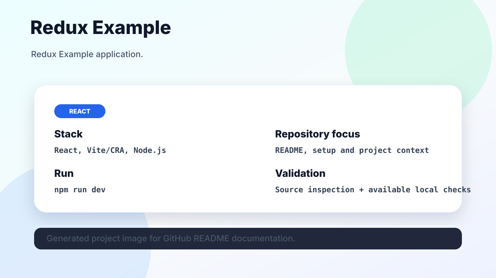

# Redux Example

Redux Example application.



## Stack

- React
- Vite/CRA
- Node.js

## What this repository contains

This repository contains the source code and documentation for **redux-example**. The README was refreshed to make the project easier to understand, run and validate from GitHub.

## Project image

The image above represents the current project state. When a local browser runtime was available, it was captured from the running project; otherwise it is an honest architecture/overview image based on source inspection.

## Getting started

```bash
git clone https://github.com/luisMakesIt/redux-example.git
cd redux-example
```

### Install dependencies

```bash
npm install
```

### Run locally

```bash
npm run dev
```

## Available scripts / commands

| Command | Description |
| --- | --- |
| `dev` | `vite` |
| `build` | `vite build` |
| `lint` | `eslint . --ext js,jsx --report-unused-disable-directives --max-warnings 0` |
| `preview` | `vite preview` |

## Validation notes

- npm install completed.
- npm run build completed.
- Local dev server did not become reachable; using overview image.

## Suggested next improvements

- Add automated tests or CI if the project does not have them yet.
- Keep environment-specific values out of version control.
- Document any external services required to run the project locally.
